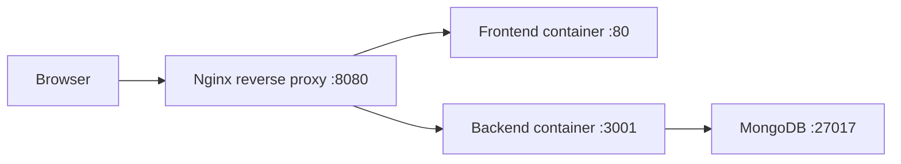

# Fullstack Blog Coursework 2

Курсовой full-stack проект по миграции учебного блога из frontend-only реализации в схему `React + Node.js + Express.js + MongoDB` с локальным `docker compose` и единым входом через reverse proxy.

## Project Status

На 2026-03-11 в репозитории уже собраны и локально проверены:
- `Frontend/` с API-вызовами через proxy-friendly base URL;
- `Backend/` с auth, posts, comments, users и roles endpoints;
- migration-style bootstrap для MongoDB с журналом прогонов;
- full-stack compose-контур `mongo + backend + frontend + reverse-proxy`;
- smoke-проверка runtime через `http://localhost:8080`;
- frontend regression coverage для post HTML rendering/edit flow и protected screens.

Следующий отдельный этап после этого состояния: доработка и расширение пользовательской документации, затем чистая локальная приемка перед merge в `dev`.

## Repository Layout

- `Frontend/` — React SPA
- `Backend/` — Express API и MongoDB migrations
- `DevOps/` — reverse proxy и deployment-oriented конфиги
- `docs/` — архитектура, план миграции и reverse/parity runbooks

## Runtime Architecture



Ключевые правила текущего runtime:
- пользовательская проверка идет через `reverse-proxy`, а не через разрозненные host-порты сервисов;
- `frontend` ходит в backend через `/api`;
- обычный startup backend не должен делать destructive reset базы;
- reset базы допустим только через явный `npm run seed`.

## Main Documents

- `docs/architecture.md` — целевая архитектура и API-контракты
- `docs/migration-plan.md` — этапы миграции, зависимости и риски
- `docs/frontend-parity-runbook.md` — локальный parity-runbook по frontend сценариям
- `docs/reverse-tests/README.md` — структура reverse/parity-проверок
- `docs/reverse-tests/test-cases.md` — стабильная матрица ручных проверок
- `docs/reverse-tests/revisions/2026-03-11-reverse-test-07.md` — compose/proxy smoke после migration-style bootstrap

## Compose Startup

Основной локальный вход для full-stack проверки:

```bash
cp .env.example .env
docker compose up --build -d
docker compose ps
```

После запуска приложение должно быть доступно через [http://localhost:8080](http://localhost:8080).

Сервисы стека:
- `mongo`
- `backend`
- `frontend`
- `reverse-proxy`

Что делает backend в compose:
- `npm run migrate` — повторяемо применяет Mongo migrations;
- `npm run start:compose` — сначала миграции, затем API runtime;
- `npm run seed` — отдельная ручная операция для reset + повторного bootstrap.

## Smoke Check

Минимальный smoke после подъема compose:

```bash
curl -s -I http://127.0.0.1:8080/
curl -s -I http://127.0.0.1:8080/api/health
curl -s -I http://127.0.0.1:8080/users
curl -s -I http://127.0.0.1:8080/post
curl -s http://127.0.0.1:8080/api/posts
```

Ожидаемый результат:
- `GET /` возвращает frontend shell;
- `GET /api/health` возвращает `200`;
- deep links `/users` и `/post` отдаются через SPA shell;
- `GET /api/posts` возвращает baseline posts из MongoDB через proxy.

## Local Non-Compose Run

Если нужен раздельный локальный запуск без compose:

```bash
cp Backend/.env.example Backend/.env
cd Backend && npm install && npm run seed && npm run dev
cd Frontend && npm install && npm start
```

В этом режиме frontend ожидает backend API на `http://localhost:3001/api`.

## Demo Data and Seed

Базовый seed создает:
- роли `admin`, `moder`, `reader`, `guest`;
- demo-аккаунты `admin / Admin#123`, `moder / Moder#123`, `reader / Reader#123`;
- baseline posts для guest/list/post сценариев;
- baseline comments для comment/moderation smoke-check.

Если нужен расширенный baseline из reference-проекта:

```bash
cd Backend
MONGO_URI=mongodb://127.0.0.1:27017/fullstack-blog-coursework-2 npm run seed:reference
```

Reference import:
- тянет данные из `author-blog/db.json`;
- сохраняет smoke-аккаунты для локальных проверок;
- дает расширенный набор users/posts/comments поверх базового runtime smoke.

## Regression and Reverse Testing

Reverse-проверки ведутся в `docs/reverse-tests/`.

На текущем этапе уже зафиксированы:
- baseline parity against `author-blog`;
- post-merge re-check по deep links и backend ACL;
- regression coverage для post HTML rendering/edit flow;
- regression coverage для protected frontend screens;
- compose + nginx proxy smoke после migration-style Mongo bootstrap.

Текущий быстрый regression-запуск:

```bash
cd Frontend
CI=true npm test -- --runInBand --watch=false post-content.test.jsx post-form.test.jsx private-content.test.jsx users.test.jsx
```
