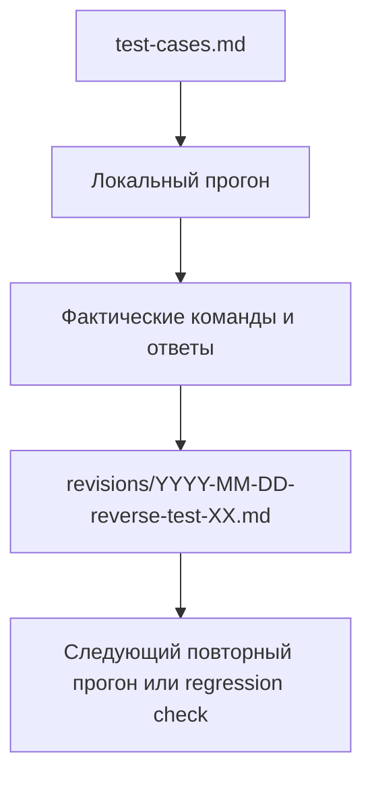

# Reverse Tests

Каталог хранит reverse/parity-проверки full-stack проекта относительно reference baseline из `author-blog`.

## Purpose

Этот раздел нужен, чтобы:
- фиксировать фактические ручные и полуавтоматические прогоны;
- отделять стабильную тестовую матрицу от конкретных запусков;
- видеть историю regressions и повторных подтверждений runtime;
- быстро восстановить минимальный smoke-набор перед merge или deploy.

## Structure

- `test-cases.md` — стабильная матрица сценариев, которую можно переиспользовать между прогонами
- `revisions/` — датированные отчеты с фактическими результатами

## Verification Flow

## Revision Rules

1. Каждый новый прогон фиксируется отдельным файлом в `revisions/`.
2. Имя файла: `YYYY-MM-DD-reverse-test-XX.md`.
3. В каждой ревизии обязательно указывать команды запуска, окружение, порты, креды, parity-таблицы, negative checks, blockers и ограничения.
4. Если изменилась сама матрица проверок, сначала обновляется `test-cases.md`, затем уже создается новая ревизия.
5. Compose/proxy приемка должна фиксироваться через единый вход `http://localhost:8080`, если цель прогона касается full-stack runtime.

## Coverage Map

Текущая история ревизий по смысловым блокам:
- `2026-03-11-reverse-test-01.md` — baseline reverse-test для fullstack parity against `author-blog`
- `2026-03-11-reverse-test-02.md` — повторный прогон после фикса seed demo-state, `commentsCount` и error UX
- `2026-03-11-reverse-test-03.md` — post-merge runtime re-check по frontend deep links и backend ACL
- `2026-03-11-reverse-test-04.md` — targeted UI regression fix для post HTML rendering/edit prefill
- `2026-03-11-reverse-test-05.md` — automated regression coverage для post HTML rendering/edit prefill
- `2026-03-11-reverse-test-06.md` — automated ACL/UI guard coverage для protected frontend screens
- `2026-03-11-reverse-test-07.md` — docker-compose + nginx reverse proxy smoke с migration-style Mongo bootstrap
- `2026-03-11-reverse-test-08.md` — полный reverse regression run по test-cases после `docker compose down -> up --build`

## When To Add a New Revision

Новая ревизия нужна, когда:
- меняется runtime-контур;
- меняются migration/seed правила;
- исправляется regression, затрагивающий UI/API parity;
- нужен повторный acceptance-check перед merge в `dev`;
- проводится отдельный smoke после `docker compose down` -> `up`.
